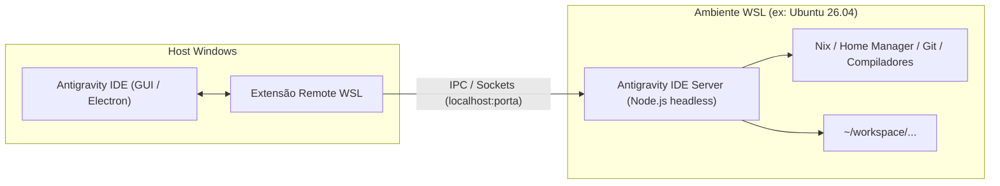

# Troubleshooting & Arquitetura: Antigravity IDE / VS Code Server no WSL

Este guia documenta os aprendizados de integração entre o **Antigravity IDE** (ou VS Code), o subsistema **WSL 2** e o gerenciador de pacotes **Nix / Home Manager**, cobrindo causas-raiz de falhas comuns em novas instâncias e soluções recomendadas.

---

## 1. Arquitetura de Execução Remota no WSL

O modelo de desenvolvimento remoto com WSL segue uma arquitetura cliente-servidor:



- **No Windows:** Roda a interface gráfica (Electron), renderização e atalhos.
- **No WSL:** Roda um servidor Node.js headless (`antigravity-ide-server`), localizado em `~/.antigravity-ide-server/bin/<versao>-<commit>/`.
- **Comunicação:** O cliente Windows se conecta ao servidor dentro do WSL via porta local segura com token (`.installation_lock` / `.token`).

---

## 2. Problemas Comuns e Causas-Raiz

### A. Falha no Download Automático do Servidor (`Error downloading server from all URLs`)

#### Sintoma:
Ao tentar conectar pelo Windows, surge o erro modal:
> *Could not establish connection to WSL distro "Ubuntu-26.04"*
> *Error: installation failed. exitCode==1==*
> *Download failed from https://redirector.gvt1.com/.../Antigravity%20IDE-reh.tar.gz*

#### Causa-Raiz:
A extensão `antigravity-remote-wsl` roda um script Bash no WSL que tenta usar `wget` para baixar o pacote do servidor do Google CDN (`edgedl.me.gvt1.com` ou `redirector.gvt1.com`). As causas mais comuns são:
1. **Interferência de VPN Corporativa (Causa Mais Comum)**: Firewalls e proxies com inspeção SSL ou políticas corporativas restritivas frequentemente interceptam requisições para domínios de edge/CDN do Google (`*.gvt1.com`, `edgedl.me.gvt1.com`), causando encerramento inesperado de handshake TLS (`SSL routines::unexpected eof`) ou falsos retornos de `HTTP 404: Not Found` nos redirects.
2. **Falta de certificados de CA atualizados**: Em imagens mínimas do Ubuntu, a falta do pacote `ca-certificates` impede a validação da cadeia de confiança TLS.
3. **Locks residuais**: Se o download falhar no meio, um arquivo vazio `~/.antigravity-ide-server/.installation_lock` permanece no disco, bloqueando qualquer nova tentativa de instalação.

#### Solução:
1. **Desconectar da VPN temporariamente**:
   Desconecte a VPN corporativa durante o primeiro handshake de conexão do Antigravity IDE ao WSL. Assim que o download de ~120MB for concluído e o servidor extraído, você pode reconectar a VPN e trabalhar normalmente.
2. **Limpar Locks e Pastas Corrompidas**:
   ```bash
   rm -rf ~/.antigravity-ide-server
   ```
3. **Garantir os pacotes de rede e descompressão**:
   ```bash
   sudo apt update && sudo apt install -y curl wget ca-certificates tar gzip procps
   ```
4. **Reconectar via CLI do Terminal**:
   ```bash
   agy .
   ```

---

### B. Prompt Interativo do VS Code no Home Manager (`DONT_PROMPT_WSL_INSTALL`)

#### Sintoma:
Ao rodar a ativação do Home Manager (`nix run home-manager/master -- switch ...`), o terminal pausa com a seguinte mensagem interativa:
> *To use Visual Studio Code with the Windows Subsystem for Linux, please install Visual Studio Code in Windows and uninstall the Linux version in WSL.*
> *Do you want to continue anyway? [y/N]*

#### Causa-Raiz:
A presença do módulo `programs.vscode` gerenciado pelo Nix tenta configurar os perfis de extensões no Linux. Ao detectar o WSL, o script de ativação do Home Manager solicita confirmação manual do usuário para não sobrepor o binário do Windows.

#### Solução:
Definir a variável de ambiente `DONT_PROMPT_WSL_INSTALL = "1"` nas variáveis de sessão globais do Home Manager ([home.nix](file:///home/alexandre/.dotfiles/home.nix)):
```nix
home.sessionVariables = {
  DONT_PROMPT_WSL_INSTALL = "1";
};
```
Isso desativa a interrupção interativa e permite automação completa (CI/CD ou scripts sem intervenção).

---

### C. Nome da Distro Hardcoded na Função de Atalho (`agy`)

#### Sintoma:
Ao executar o comando `agy .` em uma máquina com uma versão diferente do Ubuntu (ex: `Ubuntu-26.04`), o IDE tenta se conectar à distribuição antiga (`ubuntu-24.04`) ou abre um arquivo local no Windows com erro de autoridade remota.

#### Causa-Raiz:
O atalho usava a URI fixa:
`vscode-remote://wsl+ubuntu-24.04$abs_path`

#### Solução:
Usar a variável de ambiente nativa injetada pelo próprio WSL, `$WSL_DISTRO_NAME`:
```bash
local distro="${WSL_DISTRO_NAME:-Ubuntu-26.04}"
"$(wslpath "$(cmd.exe /c 'echo %USERPROFILE%' 2>/dev/null | tr -d '\r')")/AppData/Local/Programs/Antigravity IDE/bin/antigravity-ide" --new-window "$uri_flag" "vscode-remote://wsl+$distro$abs_path"
```

---

## 3. Checklist de Preparação de uma Nova Máquina WSL

Ao subir uma nova distribuição WSL (ex: `Ubuntu-26.04`):

1. **Dependências Mínimas do Sistema Operacional:**
   ```bash
   sudo apt update && sudo apt install -y curl wget ca-certificates tar gzip bzip2 xz-utils procps
   ```

2. **Instalação do Nix (Single-User ou Multi-User):**
   ```bash
   sh <(curl -L https://nixos.org/nix/install) --no-daemon
   ```

3. **Clonagem dos Dotfiles e Ativação:**
   ```bash
   git clone git@github.com:alexandredct/dotfiles.git ~/.dotfiles
   cd ~/.dotfiles
   nix run home-manager/master -- switch --flake .#alexandre -b backup
   ```

4. **Recarregamento da Sessão:**
   ```bash
   exec bash
   ```

5. **Abertura do Workspace no Antigravity IDE:**
   ```bash
   agy ~/workspace
   ```
